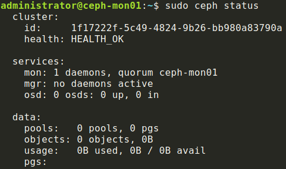
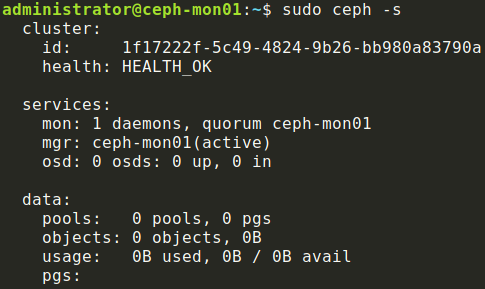

# Manual ceph deployment
This was performed on Ubuntu 18.04.

The first monitor node that was bootstrapped was the 

## Install ceph
Add ceph repository
```shell
wget -q -O- 'https://download.ceph.com/keys/release.asc' | sudo apt-key add -
sudo apt-add-repository 'deb https://download.ceph.com/debian-luminous/ bionic main'
```

Install ceph storage cluster
```shell
sudo apt-get update
sudo apt-get install -y ceph ceph-mds
```

Set up NTP
```shell
sudo apt-get install -y ntp
sudo vim /etc/ntp.conf
# Configure NTP using the ntp configuration file in this repo
sudo systemctl restart ntp
sudo systemctl enable ntp
```

## Bootstrap the monitor node
Configure the ceph cluster
```shell
# configure using ceph.conf
sudo vim /etc/ceph/ceph.conf
```

Set up keyrings
```shell
ceph-authtool --create-keyring /tmp/ceph.mon.keyring --gen-key -n mon. --cap mon 'allow *'
sudo ceph-authtool --create-keyring /etc/ceph/ceph.client.admin.keyring --gen-key -n client.admin --cap mon 'allow *' --cap osd 'allow *' --cap mds 'allow *' --cap mgr 'allow *'
sudo ceph-authtool --create-keyring /var/lib/ceph/bootstrap-osd/ceph.keyring --gen-key -n client.bootstrap-osd --cap mon 'profile bootstrap-osd'
sudo ceph-authtool /tmp/ceph.mon.keyring --import-keyring /etc/ceph/ceph.client.admin.keyring
sudo ceph-authtool /tmp/ceph.mon.keyring --import-keyring /var/lib/ceph/bootstrap-osd/ceph.keyring
```

Generate initial monitor map
```shell
# Make sure to swap out the hostname, IP, and UUID for whatever is specific to your environment
monmaptool --create --add ceph-mon01 10.4.100.11 --fsid 1f17222f-5c49-4824-9b26-bb980a83790a /tmp/monmap
```

Populate the monitor directory
```shell
sudo -u ceph mkdir /var/lib/ceph/mon/ceph-ceph-mon01
sudo chown ceph:ceph /tmp/ceph.mon.keyring
sudo -u ceph ceph-mon --mkfs -i ceph-mon01 --monmap /tmp/monmap --keyring /tmp/ceph.mon.keyring
```

Start the monitor
```shell
sudo systemctl start ceph-mon@ceph-mon01
sudo systemctl enable ceph-mon@ceph-mon01
sudo ceph -s
```
This step will fail if you tried to start the monitor in the past 30 minutes.
The systemd configuration file at `/lib/systemd/system/ceph-mon@.service` sets
the `StartLimitInterval` to 30 minutes. You can either lower this value or run
`sudo systemctl daemon-reload` to reset the timer.

Your `sudo ceph -s` output should look like this:



## Set up a manager daemon
Create daemon authentication key
```shell
sudo -u ceph mkdir /var/lib/ceph/mgr/ceph-ceph-mon01
sudo ceph auth get-or-create mgr.ceph-mon01 mon 'allow profile mgr' osd 'allow *' mds 'allow *'
# Add the output of that command to the following file
sudo -u ceph vim /var/lib/ceph/mgr/ceph-ceph-mon01/keyring
```

Start the manager
```shell
sudo systemctl start ceph-mgr@ceph-mon01
sudo systemctl enable ceph-mgr@ceph-mon01
sudo ceph -s
```

Your `sudo ceph -s` output should look like this:



## Installing further monitors
When adding a new monitor to the cluster, first work through the "Install ceph"
section.